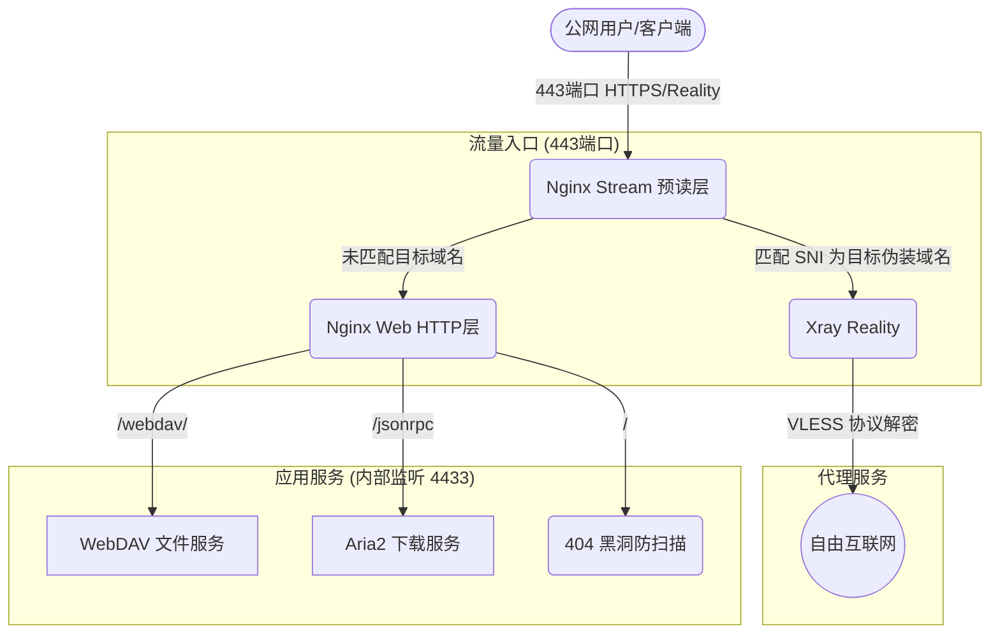

# Ansible RackNerd 系统全景架构解析

本项目是一个面向个人 VPS 节点（如 RackNerd）的高度模块化、声明式的自动化部署系统。核心思路是 **“主机差异化”**、**“零硬编码”** 与 **“安全闭环”**，经过一系列深入重构，目前已经形成了一套极简而强悍的基础设施。

## 一、 核心流量架构 (Traffic Flow)

整个系统的核心网络架构基于 **Xray Reality + Nginx SNI 前置分流** 模式。该模式能够在 443 端口同时完美兼容“伪装网站（WebDAV/Aria2）”与“科学上网（Xray）”，抗主动探测能力极强。



## 二、 核心逻辑与亮点

* **多机架构设计**：完全弃用 `group_vars`，通过 `host_vars/主机名/` 实现多台 VPS 的精准控制，支持不同域名、端口及密钥配置。
* **网络连通与业务域名分离**：在 `hosts.yml` 中强制使用公网 IP（`ansible_host`）以保障底层的 SSH 连接稳定性，而在 `host_vars` 中将域名抽离为纯业务变量（`domain`）。这彻底解决了全新主机部署时，因 DNS 记录尚未生效而导致 Ansible 无法连接的“鸡生蛋”困境。
* **WebDAV 管理增强**：通过 Nginx `add_after_body` 注入自定义脚本，实现网页端图标预览及**路径纠偏后的直接删除**功能。
* **Xray 自动化闭环**：一键部署并同步生成 JSON、VLESS 链接及二维码，彻底消除手动拼写的风险。
* **SSL 自动化 (零竞态)**：内置 Certbot 逻辑，申请证书前自动关停 Nginx 以释放 80 端口，解决首次部署的端口冲突。
* **三重严格校验**：`ansible.sh` 集成代码执行与语法校验逻辑，从根源杜绝生产崩溃。

## 三、 项目组织与环境变量

系统抛弃了老旧的 `group_vars` 设计，转而使用 `host_vars` 精准控制多台主机的差异化配置。

````text
├── ansible.cfg               # 性能优化配置 (Pipelining, ControlMaster)
├── check_status.yml          # VPS 资源与业务健康看板
├── ansible.sh                # 自动化部署入口脚本
├── hosts.yml                 # 主机清单 (按业务组划分，仅保留 IP 保障 SSH 连通)
├── host_vars                 # 主机级变量目录 (变量隔离存放)
│   └── vps_primary
│       ├── secrets.yml       # 敏感信息 (密码哈希等，不入公用库)
│       └── vars.yml          # 单机基础配置 (域名、端口、用户名等)
├── keys                      # 私钥目录 (不参与变量解析，更安全)
├── roles                     # 功能角色目录 (极致解耦)
│   ├── application           # 应用层 (Aria2/WebDAV)
│   ├── infrastructure        # 基础层 (Nginx 骨架, DDNS, 系统优化)
│   ├── security              # 安全层 (SSH 强化, 防火墙, Fail2ban)
│   └── vpn                   # 代理层 (Xray 安装与订阅分发)
└── site.yml                  # 部署总入口 (挂载所有 Roles)
````

## 四、 Roles 分工深度解析

经过极限重构，4 大 Role 各司其职，模块间完全解耦。

### 1. Security (安全壁垒)
**职责**：系统开荒后的第一道防线。
- **SSH 强化**：分发本机公钥，随后强行关闭密码登录，并利用执行脚本切断默认 22 端口暴露。
- **Firewalld**：初始化系统防火墙，仅放行 SSH 和 443 端口，所有内部端口（如 10086, 6800, 4433）严格对公网隐身。
- **Fail2ban**：自动封禁恶意爆破 SSH 的攻击者 IP。

### 2. Infrastructure (基础设施)
**职责**：纯粹的运行环境“容器”，不涉及任何上层业务逻辑。
- **System**：开启 BBR 加速，设置虚拟内存 (Swap)，配置日志轮转 (Logrotate)。
- **Nginx 基建**：安装 Nginx，配置 443 端口的 Stream 预读转发。在内部的 HTTPS 层（监听 4433），仅提供一个“空壳”骨架 `site.conf.j2`，它通过 `include /etc/nginx/conf.d/*.locations.d/*.conf;` 动态加载挂载进来的子业务模块。
- **SSL / DDNS**：调用 Certbot 申请证书，自动配置动态域名解析。

### 3. Application (应用层)
**职责**：提供面向用户的具体网络业务。
- **Aria2**：部署下载服务，并通过 `nginx-aria2.conf.j2` 模板将 `/jsonrpc` 路由**注入**到 Nginx 的 `locations.d` 目录中。
- **WebDAV**：将 `/webdav/` 路由（附带密码校验和前端图标增强脚本 `webdav_footer.html`）注入到 Nginx 中。

### 4. VPN (代理层)
**职责**：提供隐蔽的网络加密代理隧道（被精细拆分为多个模块保持高可读性）。
- **安装 (install.yml)**：幂等地调用官方脚本安装最新 Xray Core。
- **密钥生成 (keys.yml)**：**亮点机制**。在服务器本地全自动生成并保存 UUID 及 X25519 Reality 公私钥，附带损坏自愈修复功能。
- **服务端启停 (server.yml)**：渲染服务端配置并自启。
- **网络集成 (network.yml)**：向 Nginx 注入 Xray 的回源分流配置，并在 Firewalld 中添加富规则 (Rich Rule) 彻底封死 10086 的公网暴露面。
- **客户端凭证下发 (client.yml)**：自动生成标准 `config.json` 配置、`vless://` 链接，并调用 `qrencode` 渲染二维码 (PNG)，支持直接扫码导入手机。

## 五、 运维与健康监控 (check_status.yml)

项目自带了一套强大的健康审计看板，独立于部署流程外使用。
运行 `ansible-playbook check_status.yml` 即可获取。

通过探测内部端口及 HTTPS 协议响应，它真实反馈：
1. **系统进程 (Systemd)**: Nginx, Xray, Aria2, Firewalld, Fail2ban 的底层运行状态。
2. **路由连通性**: Nginx 内部的 WebDAV 是否能正常响应访问。
3. **安全审计**: SSH 22 端口是否已被彻底屏蔽。
4. **资源占用**: 物理内存 Swap 的开启状况及物理硬盘剩余空间。
